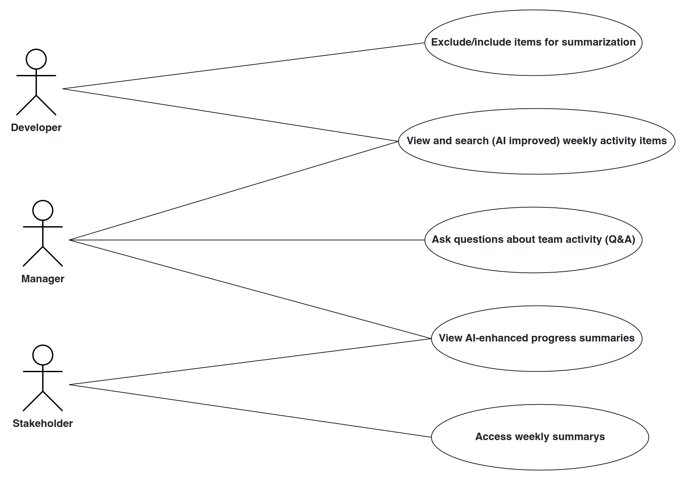
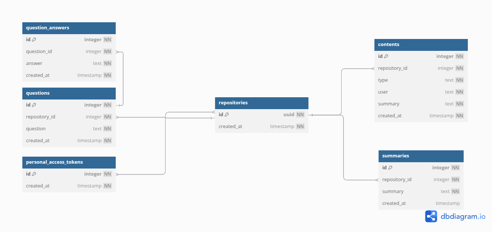

# Prompteus - We help diverse teams keep up with others changes

As companies grow, answering the simple question “What’s happening right now?” becomes increasingly hard. Information is spread across tools, projects, and teams, making it difficult to get a clear, high-level view. 
Weekly status reports and ad‑hoc “What’s going on?” questions drain developer time and still leave managers digging through GitHub with its barely working search functionality and pretty labour-intensive project management.

Teams need a zero‑friction way to surface work done, and answer follow‑up questions—all in one place, automatically.

For a deeper description of what we are building, please see our [problem statement](docs/PROBLEM_STATEMENT.md).

## Progress reports

| Week | Frank | Stefan | Wolfgang |
|--------|--------|--------|--------|
| 1 | Shared vision about GitHub summarisation | Shared vision about Books-recommender service | Collaborated on both |

further progress reports starting at week 2 are available [on confluence](https://confluence.aet.cit.tum.de/spaces/DO25WR/pages/258581342/Team+Promptheus)

## Screenshots

TBD

## Architecture of the systems

- <details><summary>High level systems architecture diagram</summary>
  
  TODO
  
  </details>
- <details><summary>Usecase diagram</summary
  
  
  
  </details>
- <details><summary>database layout diagram</summary>
  
  > [!TIP]
  > You can view the DBML diagram interactively here:
  <https://www.dbdiagram.io/d/681e071a5b2fc4582fec9d54>

  
  
  </details>


## Getting Started

To get a local demo environment running, you can run 

```shell
COMPOSE_BAKE=true docker compose up
```

You can now head over to [`http://localhost:3000`](http://localhost:3000) to look at the website.
The Backends API is documented at [`http://localhost:8080/docs`](http://localhost:8080/docs)

## Contributing

For contributing, we provide a [docker compose-watch](https://docs.docker.com/compose/how-tos/file-watch/) compatible setup.

```shell
COMPOSE_BAKE=true docker compose watch
```
