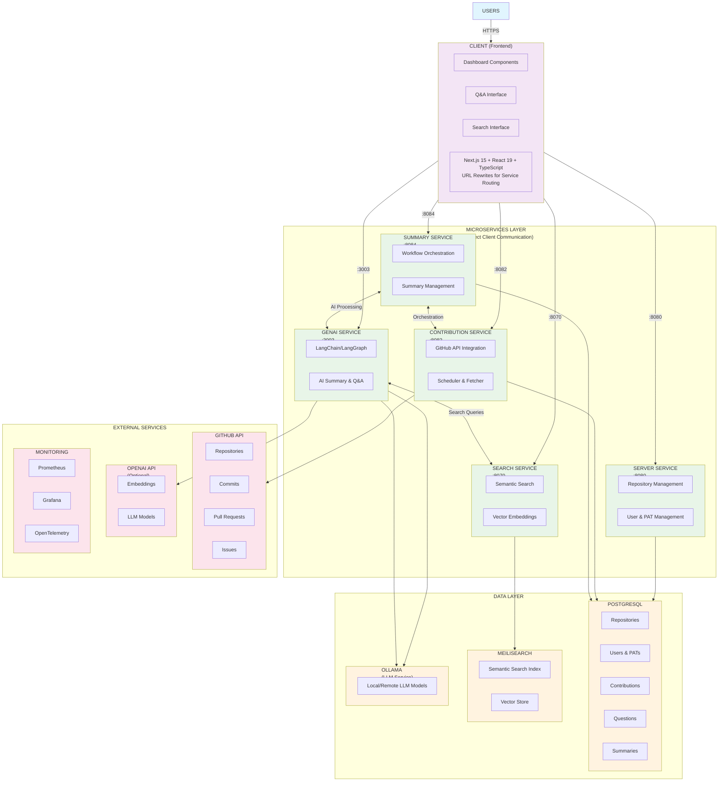
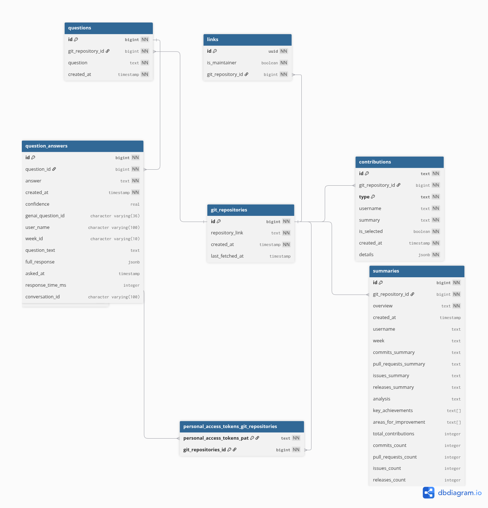

# Prompteus - We help diverse teams keep up with others changes

As companies grow, answering the simple question "What's happening right now?" becomes increasingly hard. Information is spread across tools, projects, and teams, making it difficult to get a clear, high-level view. Weekly status reports and ad-hoc "What's going on?" questions drain developer time and still leave managers digging through GitHub with its barely working search functionality and pretty labour-intensive project management.

Teams need a zero-friction way to surface work done, and answer follow-up questions—all in one place, automatically.

For a deeper description of what we are building, please see our [problem statement](docs/PROBLEM_STATEMENT.md).

## Progress reports

| Week | Frank | Stefan | Wolfgang |
|--------|--------|--------|--------|
| 1 | Shared vision about GitHub summarisation | Shared vision about Books-recommender service | Collaborated on both |

further progress reports starting at week 2 are available [on confluence](https://confluence.aet.cit.tum.de/spaces/DO25WR/pages/258581342/Team+Promptheus)

## Screenshots

TBD

## Architecture of the systems

### High level systems architecture diagram



### Usecase diagram


### database layout diagram

> [!TIP]
> You can view the DBML diagram interactively here:
<https://www.dbdiagram.io/d/681e071a5b2fc4582fec9d54>



## Getting Started

To get a local demo environment running, you can run

```shell
COMPOSE_BAKE=true docker compose up
```

You can now head over to [`http://localhost:8081`](http://localhost:8081) to look at the website.
The Backends API is documented at [`http://localhost:8080/docs`](http://localhost:8080/docs)

### Running with Local LLM Models

By default, the system uses remote Ollama services. If you want to run LLM models locally (requires NVIDIA GPU*), you can use the `llm-local` profile:

```shell
# Run with local Ollama service (requires NVIDIA GPU)
COMPOSE_BAKE=true docker compose --profile llm-local up
```

**Requirements for local LLM:**
- NVIDIA GPU with CUDA support (AMD apparently works as well, untested)
- Docker with GPU support enabled
- Sufficient GPU memory for the models (typically 4GB+ for small models)

For more information, visit the [Ollama Information on Docker Hub](https://hub.docker.com/r/ollama/ollama).

The local Ollama service will be available at `http://localhost:11434` and will automatically download the required models on first run.

**Configuration for Local Ollama:**
When using the `llm-local` profile, you may want to override the Ollama base URL to use your local instance. Copy the example environment file and modify it:

```env
OLLAMA_BASE_URL=http://ollama:11434
```

## Contributing

For contributing, we provide a [docker compose-watch](https://docs.docker.com/compose/how-tos/file-watch/) compatible setup.

```shell
COMPOSE_BAKE=true docker compose watch
```
### Demo Script

For a comprehensive demonstration of the AI-powered GitHub analysis features, you can run the interactive demo script:

```shell
# Make sure the container is up and running
docker compose up --build genai

# Run the demo with your GitHub repository
docker compose exec genai python scripts/demo.py --user <your-username> --repo <owner/repo> --week <YYYY-WXX> --github-token <github_pat_XXXX...>
```

The demo showcases:
- **GitHub Integration**: Fetch contributions automatically via GitHub API
- **AI Summary Generation**: Live streaming summaries of your weekly work
- **Interactive Q&A**: Ask questions about your contributions with evidence-based answers
- **Rich Analytics**: Detailed contribution analysis and insights

**Coming Soon**: Conversational Q&A sessions with context retention and broader insights beyond evidence.

See [`genai/README.md`](genai/README.md) for detailed API documentation and configuration options.

## CI/CD Pipeline

GitHub Actions workflows handle continuous integration and deployment for all microservices:

### Service Workflows
- [`genai-cicd.yml`](.github/workflows/genai-cicd.yml) - AI/ML service with LLM testing
- [`client-cicd.yml`](.github/workflows/client-cicd.yml) - Frontend application
- [`server-cicd.yml`](.github/workflows/server-cicd.yml) - Main backend API
- [`search-cicd.yml`](.github/workflows/search-cicd.yml) - Search microservice
- [`summary-cicd.yml`](.github/workflows/summary-cicd.yml) - Summary generation
- [`contribution-cicd.yml`](.github/workflows/contribution-cicd.yml) - GitHub collector

### Deployment
- [`compose-check.yml`](.github/workflows/compose-check.yml) - Integration testing
- [`cd-ase.yml`](.github/workflows/cd-ase.yml) - Kubernetes deployment (Helm)
- [`aws-deploy.yml`](.github/workflows/aws-deploy.yml) - AWS EC2 deployment

Each pipeline includes type checking, testing, Docker builds, and OpenAPI generation.
For instructions on how to deploy the application for prodcution, please refer to [`k8s`](k8s/README.md) directory.

### Monitoring
- Prometheus: [prometheus-prompteus.student.k8s.aet.cit.tum.de](https://prometheus-prompteus.student.k8s.aet.cit.tum.de/)
- Grafana: [grafana-prompteus.student.k8s.aet.cit.tum.de](https://grafana-prompteus.student.k8s.aet.cit.tum.de/) (admin/admin)

### Linting

In this repository, we use [pre-commit](https://pre-commit.com/) to ensure code quality and consistency. To set it up, follow these steps:

```shell
pip install pre-commit
# Install the hooks
pre-commit install
```

It can also be run manually:

```shell
pre-commit run --all-files
```

## Operations/ Monitoring

We provide a [prometheus interface here](https://prometheus-prompteus.student.k8s.aet.cit.tum.de/) and grafana (admin/admin) [here](https://grafana-prompteus.student.k8s.aet.cit.tum.de/).
For further details, how the rest of the system (tracing, profiling, logs) is set up, please see [these docs](MONITORING.md)
