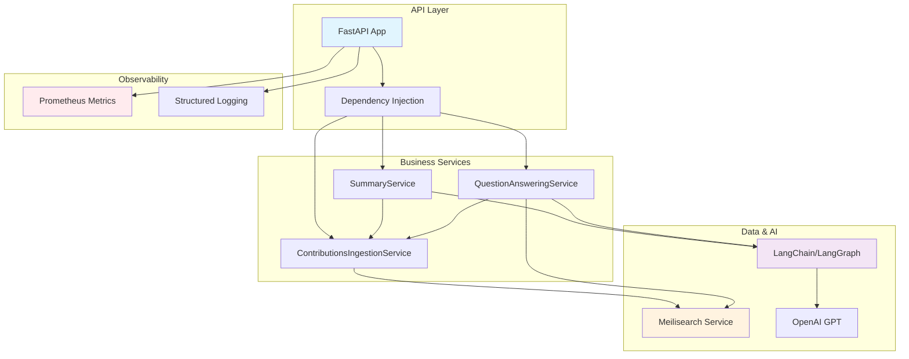
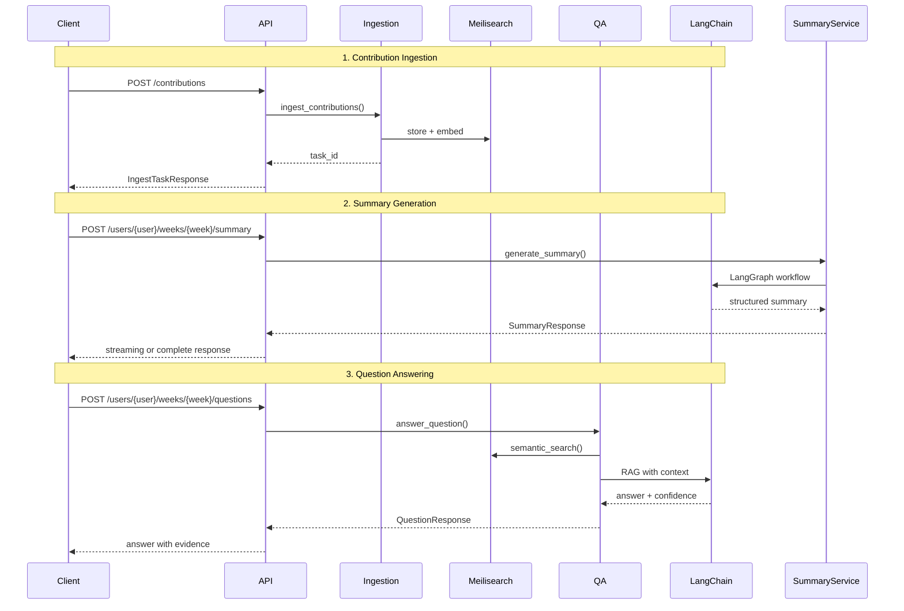

# Prompteus GenAI Service

AI-powered service for analyzing GitHub contributions and providing intelligent Q&A about developer weekly summaries.

## 🚀 What Works

### Core Functionality
- **Contribution Ingestion**: Store GitHub contributions with user/week organization
- **AI Summary Generation**: LangChain/LangGraph-powered structured summaries with streaming support
- **Context-Aware Q&A**: Ask questions about contributions with evidence and confidence scoring
- **Semantic Search**: Meilisearch integration for finding relevant contributions
- **Prometheus Metrics**: Comprehensive observability and monitoring
- **Task-based Processing**: Async ingestion with progress tracking

### API Endpoints
For complete API documentation, see the **[Scalar API Reference](/reference)** when the service is running.

## 🏗️ How It Works

### Service Architecture



### Data Flow



## 📊 Metrics & Observability

### Prometheus Metrics (Implemented)

#### Summary Generation
- `genai_summary_generation_requests_total` - Generation requests by status
- `genai_summary_generation_duration_seconds` - Processing time
- `genai_summary_generation_tokens_total` - Token usage tracking

#### Question Answering  
- `genai_question_answering_requests_total` - Q&A requests by status
- `genai_question_answering_duration_seconds` - Response time
- `genai_question_confidence_score` - Confidence distribution

#### LangChain Operations
- `genai_langchain_model_requests_total` - Model invocations
- `genai_langchain_model_duration_seconds` - Model operation time
- `genai_langchain_model_errors_total` - Model errors

#### Meilisearch Integration
- `genai_meilisearch_requests_total` - Search operations
- `genai_meilisearch_duration_seconds` - Search performance

## 🚦 Getting Started

### Quick Start

```bash
# Set environment variables
cp env.example .env
# Edit .env with your OpenAI API key and other config

# Start services
docker compose up -d

# Access API docs
open http://localhost:3003/reference
```

### Configuration

See [`.env.example`](./env.example), there is not a lot more you can / want to configure right now.

## 🧪 Development

### Running Tests
```bash
docker compose exec genai pytest tests/
docker compose exec genai pytest --cov=src tests/
```

### Demo Script
```bash
docker compose exec genai python scripts/demo.py
```
