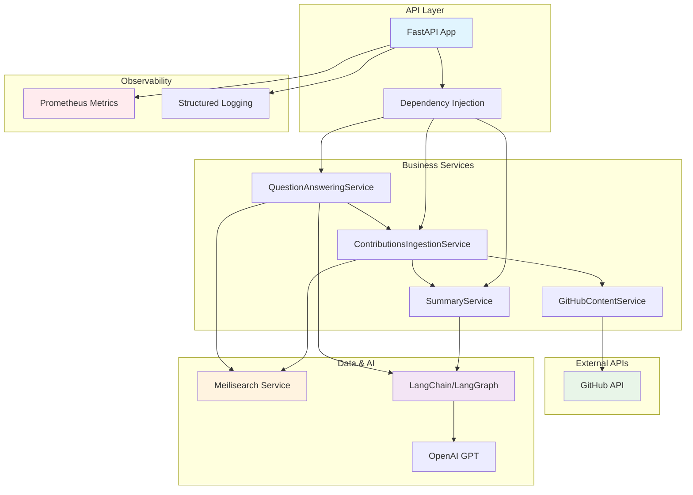
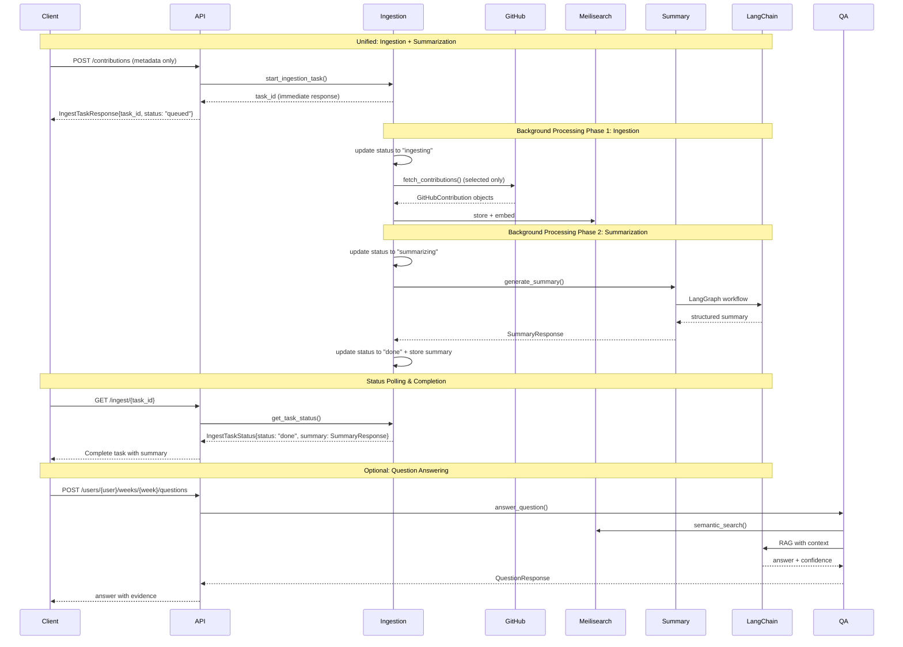
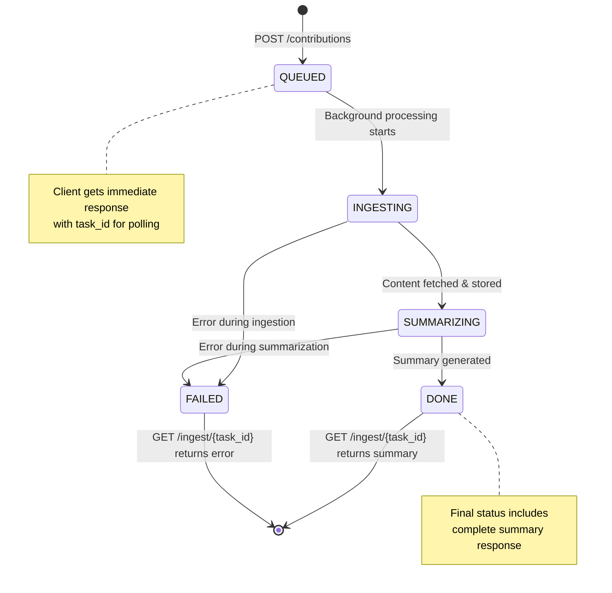

# Prompteus GenAI Service

AI-powered service for analyzing GitHub contributions and providing intelligent Q&A about developer weekly summaries.

## 🚀 What Works

### Core Functionality
- **Metadata-Only Ingestion**: Efficient processing with GitHub API integration for on-demand content fetching
- **Unified Task Workflow**: Single endpoint handles ingestion, processing, and summarization
- **AI Summary Generation**: LangChain/LangGraph-powered structured summaries with real-time progress tracking
- **Context-Aware Q&A**: Ask questions about contributions with evidence and confidence scoring
- **Conversation Context**: Follow-up questions maintain context from previous Q&As in the same session
- **Semantic Search**: Meilisearch integration for finding relevant contributions
- **Prometheus Metrics**: Comprehensive observability and monitoring
- **GitHub Content Service**: Secure token-based GitHub API integration
- **GitHub Agent Tools**: Langchain-compatible tools for real-time access to GitHub repositories
- **Reflection**: Langchain-powered reflection on the conversation history to improve the answer

For complete API documentation, see the **[Scalar API Reference](/reference)** when the service is running.

## 🚀 How It Works

### Service Architecture



### Unified Workflow Data Flow



### Task Status Flow



## 📊 Metrics & Observability

### Prometheus Metrics (Implemented)

#### Task Processing
- `genai_ingestion_tasks_total` - Task creation and completion by status
- `genai_task_processing_duration_seconds` - End-to-end task processing time
- `genai_github_api_requests_total` - GitHub API calls by type and status

#### Summary Generation
- `genai_summary_generation_requests_total` - Generation requests by status
- `genai_summary_generation_duration_seconds` - Processing time
- `genai_summary_generation_tokens_total` - Token usage tracking

#### Question Answering
- `genai_question_answering_requests_total` - Q&A requests by status
- `genai_question_answering_duration_seconds` - Response time
- `genai_question_confidence_score` - Confidence distribution

#### LangChain Operations
- `genai_langchain_model_requests_total` - Model invocations
- `genai_langchain_model_duration_seconds` - Model operation time
- `genai_langchain_model_errors_total` - Model errors

#### Meilisearch Integration
- `genai_meilisearch_requests_total` - Search operations
- `genai_meilisearch_duration_seconds` - Search performance

## 🚦 Getting Started

### Quick Start

```bash
# Set environment variables
cp env.example .env
# Edit .env with your OpenAI API key and GitHub token

# Start services
docker compose up -d

# Access API docs
open http://localhost:3003/reference
```

### Configuration

Key environment variables:
- `OPENAI_API_KEY` - Required for AI summaries and Q&A
- `GITHUB_TOKEN` or `GH_PAT` - Required for GitHub API access
- `MEILISEARCH_MASTER_KEY` - For semantic search functionality

See [`.env.example`](./env.example) for complete configuration options.

## 🧪 Development

### Running Tests
```bash
docker compose exec genai pytest tests/
docker compose exec genai pytest --cov=src tests/
```

### Demo Script

The demo script showcases the conversation context feature:
```bash
docker compose exec genai python scripts/demo.py
```

Features:
- Ask follow-up questions that maintain context
- View conversation history with `history` command
- Clear conversation with `clear` command
- Visual indicators (🔗) when answers reference previous Q&As

### API Usage Examples

#### Unified Workflow (Recommended)
```bash
# Start ingestion + summarization task (metadata-only)
curl -X POST "http://localhost:3003/contributions" \
  -H "Content-Type: application/json" \
  -d '{
    "user": "octocat",
    "week": "2024-W21",
    "repository": "octocat/Hello-World",
    "contributions": [
      {"type": "commit", "id": "abc123", "selected": true},
      {"type": "pull_request", "id": "42", "selected": true}
    ]
  }'

# Poll for completion and get summary
curl "http://localhost:3003/ingest/{task_id}"
```

#### Question Answering
```bash
# Initial question
curl -X POST "http://localhost:3003/users/octocat/weeks/2024-W21/questions" \
  -H "Content-Type: application/json" \
  -d '{
    "question": "What bugs were fixed this week?",
    "context": {
      "focus_areas": ["bugs", "fixes"],
      "include_evidence": true,
      "reasoning_depth": "detailed"
    }
  }'

# Follow-up question (maintains conversation context)
curl -X POST "http://localhost:3003/users/octocat/weeks/2024-W21/questions" \
  -H "Content-Type: application/json" \
  -d '{
    "question": "Which of those bugs were critical?",
    "context": {
      "include_evidence": true
    }
  }'
```

The question answering system automatically maintains conversation context for each user/week combination. Follow-up questions can reference previous Q&As without repeating context. Sessions are isolated per user and week.

## 🤖 GitHub Agent Tools (Langchain)

The GenAI service provides a set of Langchain-compatible tools for real-time access to GitHub repositories.
At time of writing, these tools allow agents to:

- **search_github_code**: Search for code in a repository (find implementations, functions, code patterns)
- **search_github_issues**: Search for issues (bug reports, feature requests, project discussions)
- **search_github_pull_requests**: Search for pull requests (code reviews, merges, workflow tracking)
- **get_github_file_content**: Retrieve the content of a specific file
- **get_commit_details**: Get details for a specific commit by SHA
- **get_issue_details**: Get details for a specific issue by number
- **get_pull_request_details**: Get details for a specific pull request by number

These tools are implemented in [`src/agent_tools.py`](src/agent_tools.py) and are designed for use in Langchain agent workflows. They use the `GitHubContentService` for robust, authenticated GitHub API access.
